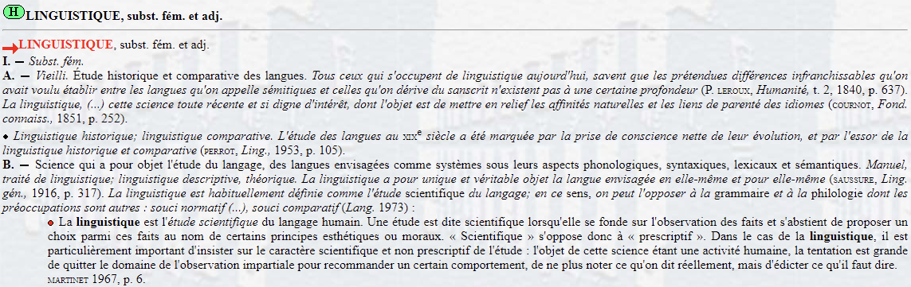
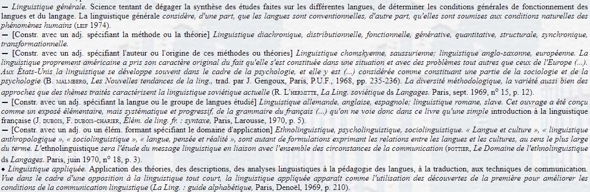
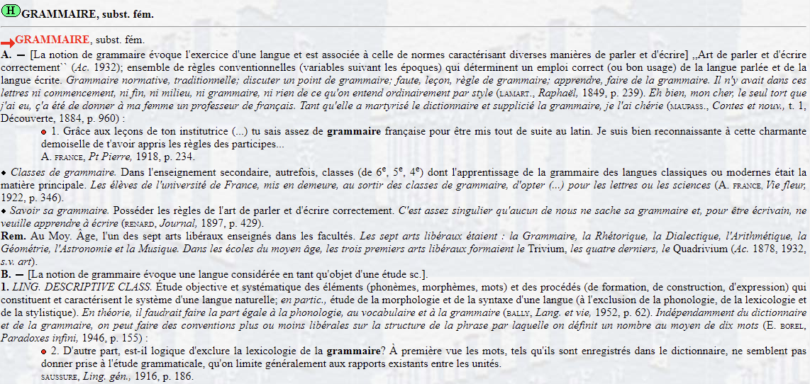
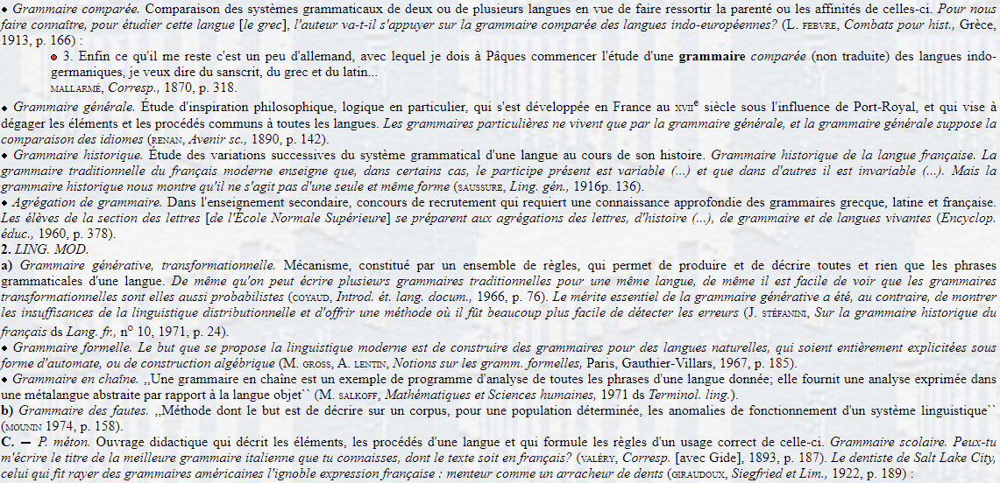
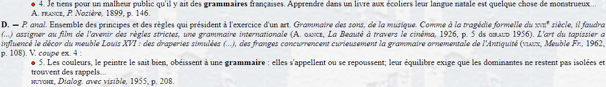
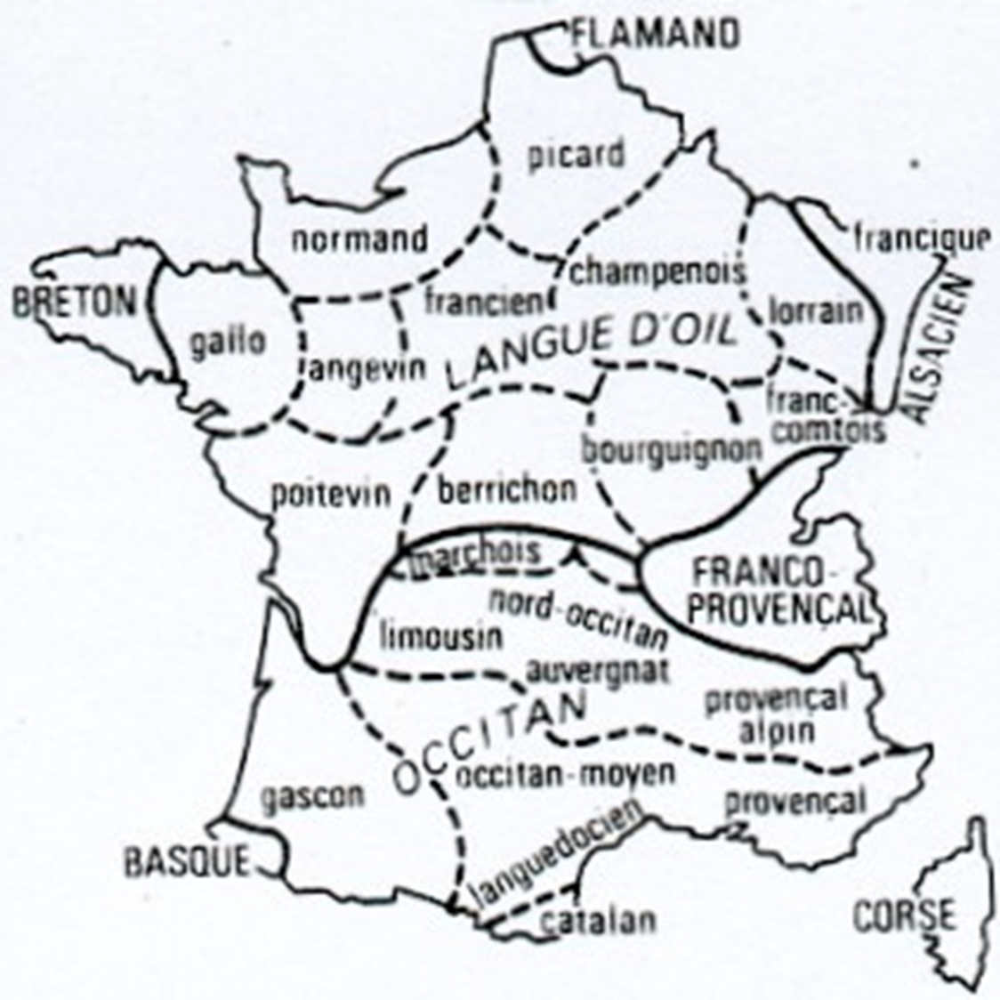
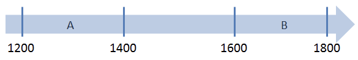
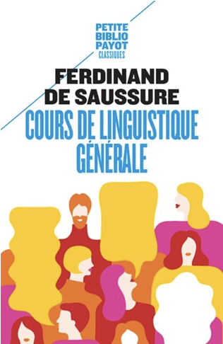

# Introduction à la linguistique diachronique

## Linguistique vs grammaire

### Le lemme *linguistique* dans le TLFi

### Le lemme *grammaire* dans le TLFi

### Linguistique vs grammaire : deux disciplines scientifiques ayant pour objet d’étude la langue « sous différents aspects »

#### Quatre différences fondamentales :

-   Objet d’étude

-   Objectif poursuivi

-   Organisation de la description

-   Terminologie utilisée

Un regard plus profond sur ces critères permet non seulement d’opposer grammaire à linguistique, mais aussi d’introduire les concepts de grammaire émergente et de changement linguistique.

## Objet d’étude

Toute variété linguistique se définit par un faisceau unique de variables diasystémiques :

### Variable diachronique

Exemple : Les Serments de Strasbourg (842) vs français moderne

| Très ancien français | Français moderne          |
|----------------------|---------------------------|
| *Pro Deo amur...*    | *Pour l’amour de Dieu...* |

Exemple : négation ancien français vs contemporain

1.  *Jeo ne mange.*

2.  *Je ne mange pas.*

### Variable diatopique

Variation phonétique Paris vs Midi

| Paris                                    | Midi      |
|------------------------------------------|-----------|
| le lait → \[lǝlɜ\]                       | \[lǝle\]  |
| aimerais / aimerai → \[emʁɜ\] / \[emʁe\] | \[eməre\] |

Genre des emprunts anglais : France vs Canada

| Anglais  | France  | Canada  |
|----------|---------|---------|
| the job  | le job  | la job  |
| the gang | le gang | la gang |

Chiffres 70 et 90 : France vs Belgique/Suisse

| France           | Belgique/Suisse |
|------------------|-----------------|
| soixante-dix     | septante        |
| quatre-vingt-dix | nonante         |

### Variable diastratique

Langue des jeunes :

-   *staïve*, *balec*

-   *stremon*, *meuf*, *tromé*

### Variable diaphasique

Registre soutenu vs familier

| Soutenu          | Familier        |
|------------------|-----------------|
| Bonjour !        | Salut !         |
| Pas de problème. | Pas d’problème. |
| Je ne sais pas…  | Je sais pas…    |

### Variable diamésique

Écrit vs oral

| Écrit                    | Oral                  |
|--------------------------|-----------------------|
| Bonjour !                | Salut !               |
| Il y a plusieurs façons… | Y’a plusieurs façons… |

### Paramètres diasystémiques = scalaires

Exemple : continuum diachronique latin → ancien français → moderne

*(tableau conservé)*

### Variétés étudiées

-   Linguistes : toutes les variétés

-   Grammairiens : langue écrite des « bons écrivains »

### Conséquences pour la grammaire

Les grammairiens décrivent un bon usage basé sur une variété écrite, souvent en décalage avec l’usage réel.

### Déviations et changement linguistique

> « La faute d’aujourd’hui est la norme de demain. » — A. Rey

-   Les déviations = innovations

-   Le changement = conventionnalisation de ces innovations

## Objectif poursuivi

### Deux objectifs :

-   Grammairien : prescriptif / normatif

-   Linguiste : descriptif / explicatif

### Attitude face aux déviations :

-   Grammairien → fautes

-   Linguiste → alternatives à décrire

## Exemple détaillé : la négation

Évolution de *pas* et *mie* du latin au français moderne (tableaux conservés).

## Exemple : le genre de *espèce*

### Questions :

a\) Quel est son genre ? b) Quel est son emploi réel ? c) Attitude grammairien vs linguiste d) Explication de l’emploi déviant

### Analyse :

-   *espèce* = féminin inhérent

-   Variation uniquement dans \[DET espèce de N\]

-   Masculin possible seulement si N est masculin

-   Réanalyse : *une espèce de N* → déterminant complexe

-   Évolution en cours : coexistence des deux formes

## Linguistique synchronique vs diachronique vs historique

### Synchronie

::: callout-note
Synchronie \> gr. σύν ‘avec’ (lat. syn) + χρόνος ‘temps’ (lat. chronos)
:::

• La position de la femme en Europe au Moyen Age

• L’économie de la France au 21e s.

• L’expression de la négation en ancien français

• …

🚨 Synchronie du passé

### Diachronie

::: callout-note
Diachronie \> διά ‘à travers’ (lat. dia) + χρόνος ‘temps’ (lat. chronos)
:::

• La position de la femme en Europe du Moyen Age au 20ième s.

• L’économie de la France du 19ième au 21ième s.

• L’expression de la négation de l’ancien français au français classique

• …

### Linguistique synchronique vs. diachronique

]{.absolute bottom=0 right=0 width="300"}

👉Genève 🇨🇭

👉Études de linguistique historique à l’Université de Leipzig, doctorat en 1879

👉Mémoire sur le système. primitif des voyelles indo-européennes (Société Linguistique de Paris, 1877)

👉1881, Maître de conférences à Paris (Ecole des hautes Etudes)

👉1892, Université de Genève: sanskrit, grammaire comparée, phonologie

👉**1906-1913, Chaire de linguistique générale, réflexions théoriques sur le langage et la linguistique**

### Historique

Histoire externe : substrats, superstrats, adstrats.

## Intérêt de la linguistique diachronique

-   Comprendre le fonctionnement de la langue

-   Typologie → prédictions

-   Cognition humaine

-   Comprendre des faits synchroniques

## Perception du changement linguistique

### Passé :

-   Idéalisation du latin, du grec

-   Vision décadente du changement

### Aujourd’hui :

-   Neutralité pour le passé

-   Normativité pour le présent

### Changement = signe de vie

### Raisons de l’accélération :

-   Mondialisation

-   Internet, réseaux sociaux

## 

7\. Difficultés pour la linguistique diachronique

1/ Besoin d’une base empirique : un corpus solide et représentatif de textes authentiques couvrant des

périodes plus ou moins étendues \> dépendance de la transmission textuelle

2/ Problèmes :

a\) Transmission textuelle pauvre, voire absente

Ex. langues exotiques, isolées

b\) Documentation (relativement) récente (\> absence de traces du passé)

J. Vangaever Historische en geografische varianten van het Frans L3 2025-2026

17

Ex. : le roumain

c\) Ruptures dans la transmission textuelle/périodes de transmission appauvrie

Ex. : les premiers stades des langues romanes

d\) Documentation exclusivement écrite jusqu’au 20ième s.

e\) Sélection des textes transmis :

• Duplication de textes : activité très chère, intensive et à refaire périodiquement

• Sélection dans les types de textes copiés

• Jusqu’à Guthenberg (1453) : duplication à la main par des copistes \> interventions conscientes et

inconscientes

3/ Néanmoins : certaines langues ont une documentation diachroniquement impressionnante

Ex. : le latin, les langues romanes, les langues germaniques

4/ Langues romanes : la famille de langues la mieux documentée : transmission quasiment ininterrompue

depuis leur émergence

5/ Situation plus unique encore : langues romanes \> latin donc documentation de plus de deux millénaires

(3ième s. BC – 21ième s. AD) : diachronie large servant de laboratoire pour tester sur corpus des

hypothèses formulées en linguistique générale et théorique (en plus : « shift typologique »)

6/ Néanmoins : documentation relativement pauvre de la période de transition entre le latin et les langues

romanes (le proto-roman, 600 – 800 AD)

7/ En outre : relativement peu de traces de la langue vulgaire. Explication ? Problème ?

8/ Le français : position privilégiée parmi les langues romanes : premiers textes au 9ième s. (\>\< espagnol et

italien : 12ième s.)

#### Autres problèmes en linguistique diachronique :

• États de langue du passé : absence de locuteurs natifs (\> pas de jugements de grammaticalité, de jugements d’acceptabilité, d’intuitions, de tests linguistiques, …)

• Risque de projeter ses propres intuitions sur un état de langue actuel sur des états de langue du passé (\> distorsions, biais)

\#### Actuellement : grand intérêt pour l’évolution du français (\> plusieurs projets de recherche nationaux et internationaux) :

• Marchello-Nizia, C. ; B. Combettes ; S. Prévost & T. Scheer (Eds.). Grande grammaire historique du

français (2 vol.). Berlin : Mouton De Gruyter, 2019

## Projets actuels

-   *Grande grammaire historique du français* (2019)

-   *Latin tardif, français ancien* (2018)

-   *Bridging the gap between Late Latin and Old French* (2016–…)

Corpus numérique : Base de français médiéval [http://txm.bfmcorpus.org](https://txm.bfmcorpus.org)
