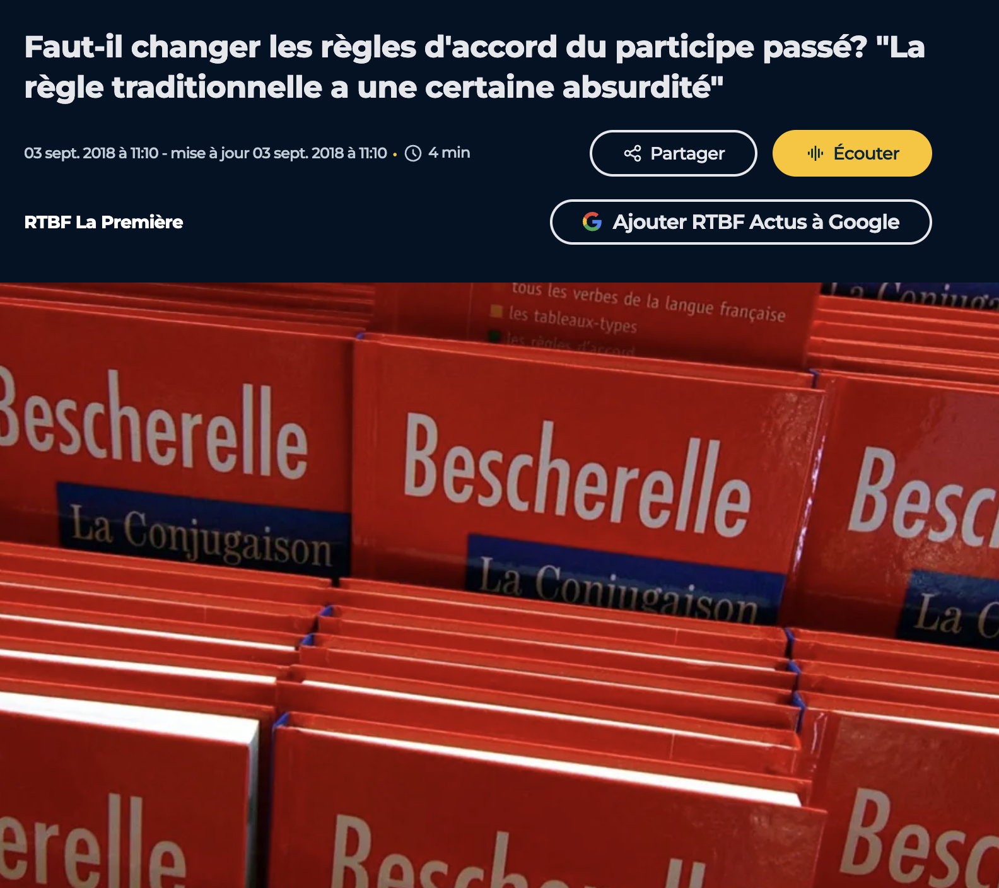
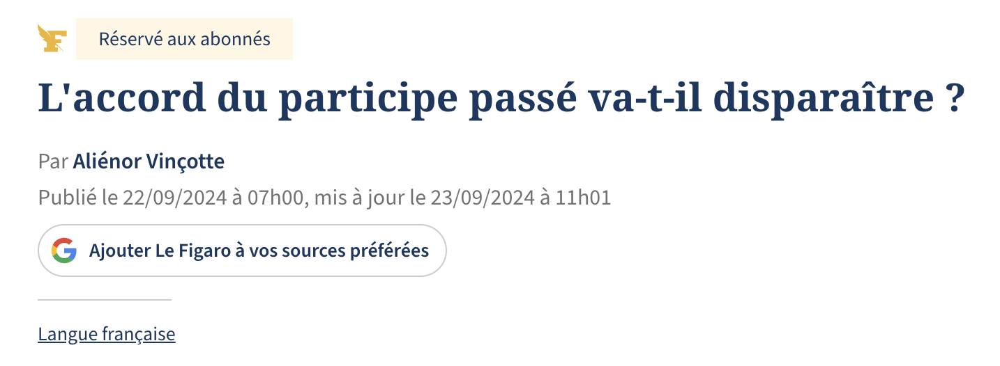
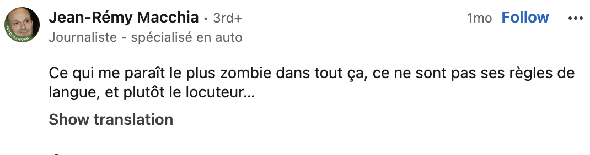
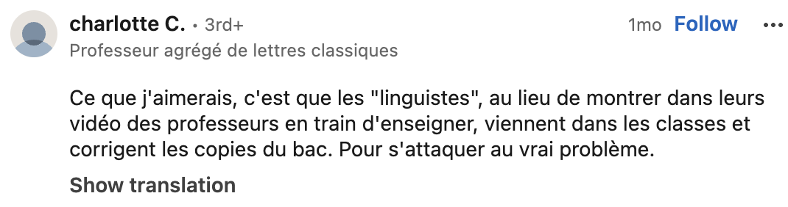
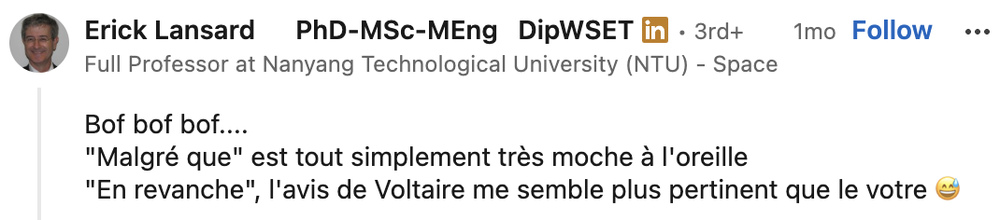
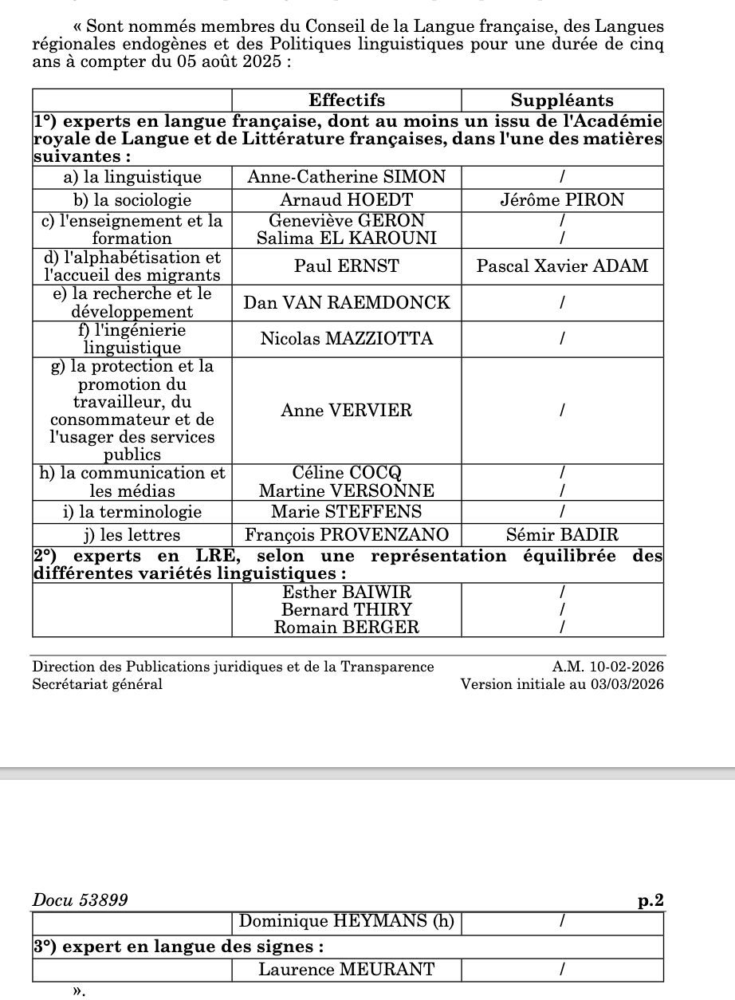

# Cours d'introduction

Bienvenue au cous de français moderne !

## Qui ?

-   Jérémy Genette, Dr. en Linguistique (Université d'Anvers)

-   Phonéticien et phonologue (de laboratoire)

-   et vous ?

## Pourquoi ce cours ?

-   Vous êtes des spécialistes de la langue française et dans votre future activité professionnelle...

    

------------------------------------------------------------------------

------------------------------------------------------------------------

[{fig-align="center"}](https://www.radiofrance.fr/francebleu/podcasts/c-est-tendance/on-ne-sait-plus-ecrire-8030663)

------------------------------------------------------------------------

[{fig-align="right"}](https://www.tiktok.com/@lefigaro/video/7428953163266362657)

------------------------------------------------------------------------

En réponse à une vidéo descriptive réalisée par un linguiste ([Lien vers la vidéo](https://www.radiofrance.fr/franceculture/podcasts/le-fil-pop-culture/en-revanche-une-espece-de-ces-regles-zombie-qui-refusent-de-mourir-4153424?at_campaign=Linkedin&at_medium=Social_media))

------------------------------------------------------------------------

## Évaluation

### Travail écrit 

### Présentation 

------------------------------------------------------------------------

## Méthodologie de la recherche en linguistique française

## La ou les grammaires ?

## Les institutions de la langue française

### L'académie française

> « L'académie française a été instaurée par Richelieu gardienne de la langue » — *Académie française*

**↔**

> « Depuis le XIXe siècle, l'académie française ne suit plus l'évolution de la langue » — *Les linguistes atterrés*

**Quel est son rôle ?**

-   Institution d'Ancien Régime fondée en 1635

-   Selon ses statuts, elle doit rédiger " promptement " 😝 un dictionnaire et une grammaire dans le but de " donner des règles certaines à notre langue et à la rendre pure, éloquente et capable de traiter les arts et les sciences

{fig-align="right"}

-   1er dictionnaire en 1694: objectif élitiste assumé pour "distinguer les gens de lettres d'avec les ignorants et les simples femmes "

-   Au total 9 éditions, la dernière en 2026

-   Mais beaucoups de critiques !

-   Un best-of : 😅

    -   *bisou* absent

    -   *mail* est défini comme gros marteau ou une promenande plantée d'arbres

    -   *femme* est définie *comme capable de concevoir et de mettre au monde des enfants*

    -   racisme

    -   homophobie

    -   *etc.*

-   L'Académie n'a jamais publié une grammaire

-   Jusqu'au XIXe siècle, ils ont bien essayé d'avoir un regard (timide) mais critique sur l'orthographe et ont simplifié certaines graphies

    -   Ex. pluriels en *-x* comme *loix* et *roix*

    -   Ex. certains *-h* comme *autheur* et *rhythme*

        ------------------------------------------------------------------------

-   à la fin du XIXe siècle, Gaston Paris est un exemple d'académicien non puriste

-   L'enseignement du français doit " sortir de ces marécages " de règles, "être plus fructueus pour l'esprit et un peu moins dangereus pour le sens "

    -   Il applique un réforme de l'orthographe, par exemple, *fructueus, dangereus*

    -   Erreurs de copistes *-us* abrégé en *-x*

    -   Comparez avec des mots récents comme *sous*, *pneus*, *landaus*

-   Dernier spécialiste de la langue siégeant à l'Académie

    -   Il

[{fig-align="right" width="500"}](https://cdn.britannica.com/11/172811-050-2A5CEC8E/Gaston-Paris.jpg)

## Conseil supérieur de la langue française

## En Belgique 🇧🇪

#### Conseil supérieur de la langue française de Belgique

#### **La Direction de la Langue française**

## En France 🇫🇷

## Au Canada 🇨🇦

## En Suisse 🇨🇭

## Séances thématiques

Si on vous dit: C'EST FAUX !

-   Pourquoi ?

-   Depuis quand ?

-   Où est la règle ?

## Séances thématiques

Si on vous dit: C'EST FAUX !

-   Pourquoi ?

-   Depuis quand ?

-   Où est la règle ?

# La linguistique de corpus

------------------------------------------------------------------------

-   **Objectif**

    Étudier les phénomènes linguistiques à partir de méthodes quantitatives, testables et mesurables.\
    Utiliser des méthodes scientifiques pour examiner comment la langue est acquise, représentée et traitée dans le cerveau, et comment nous pouvons la produire.

**Démarche**\
Manipuler systématiquement des variables pour mesurer la langue.\
Examiner la relation entre variables indépendantes et dépendantes.

**Méthodes**

-   Recherche expérimentale

-   Recherche par corpus

------------------------------------------------------------------------

**Corpus**\
Outil puissant pour étudier : acquisition, traitement, variation sociolinguistique, changement sémantique, etc.

**Pourquoi utiliser des corpus ?**\
Progrès technologiques et méthodologiques, tendance vers des résultats objectifs, mesurables et reproductibles.\
Rôle reconnu de la co-occurrence des phénomènes linguistiques dans l’acquisition et le traitement.

**Définition**\
Ensemble de langues naturelles (McEnery, Xiao & Tono, 2006).\
Regroupe des exemples autour d’un prototype.\
Langue dans des contextes spontanés, naturels, écologiques.\
Représentatif d’une langue ou d’un registre spécifique.

**Types de corpus**

-   Oral vs écrit

-   Supports variés : textes, audio, transcriptions, vidéo

-   Sources : synchronique/diachronique, parole L2, académique, enfant, clinique

-   Tailles variées. Certains "corpus" ne sont pas naturels.

------------------------------------------------------------------------

**Démarche du corpus**

1.  Question et hypothèses

2.  Corpus adapté

3.  Collecte

4.  Analyse

5.  Réponse à la question

------------------------------------------------------------------------

**Expérience musicale**\
Entendez-vous trois fois la même chose ?

-   Son 1 : G5

-   Son 2 : C5

-   Son 3 : G4

Différentes notes, différents instruments.\
Taille et forme de la cavité buccale déterminent le son perçu.\
Hauteur de voix : vitesse de vibration des cordes vocales.

------------------------------------------------------------------------

**Expérience de parole**\
F1 = 399 Hz, F2 = 856 Hz.\
Même position de la langue, mais hauteurs différentes :

-   144 Hz, 122 Hz, 100 Hz

Entendez-vous \[o\] ou \[u\] ?

------------------------------------------------------------------------

**Hauteur vocalique intrinsèque (IF0)**\
Caractéristique universelle :

-   Voyelle haute = hauteur haute

-   Voyelle basse = hauteur basse

**Hypothèses**

-   Biomécanique : une articulation orale, une laryngale ; tension accrue → vibration plus rapide

-   Perceptuelle : ajout d’une différence de hauteur

-   Mixte

**Distinction**

-   Biomécanique : pas d’IF0 sans lien biomécanique ; IF0 sans catégories vocaliques

-   Perceptuelle : pas d’IF0 sans catégories ; apprentissage nécessaire

-   Mixte : IF0 même sans catégories, mais apprentissage reste nécessaire

------------------------------------------------------------------------

**Deux perspectives**

1.  Acquisition précoce

2.  Développement avec trouble de l’audition

**Acquisition précoce**\
Exemples : \[bɑbɑ\] vs \[bɔbɔ\], \[ɦɑnt\] vs \[ɦɔnt\]\
Prédictions :

-   Biomécanique : développement de la hauteur

-   Perceptuelle : développement de la hauteur

-   Mixte : développement de la hauteur

**Trouble de l’audition**\
Mêmes prédictions selon les hypothèses.

------------------------------------------------------------------------

**Données (acquisition précoce)**

-   Bauer (1988) : 7 325 voyelles

-   Whalen et al. (1995) : 200

-   Gregory (2014) : 981

-   Cette thèse : \> 37 000

**Corpus** : CLiPS Child Language Corpus (19 enregistrements, 6–24 mois, 30 enfants).\
Enregistrements d’interactions quotidiennes.

**Analyse**\
Sélection : voyelles hautes \[i,u\] et basses \[a,ɑ\] → 37 347 voyelles.\
Analyse acoustique : détection automatique, suivi F0/F1, optimisation, exclusion des valeurs aberrantes, normalisation (Lobanov, 1971).

**Résultats**

-   Avant les premiers mots : complexité du babillage → hauteur des voyelles basses et hautes.

-   Après les premiers mots : développement du vocabulaire → hauteur des voyelles basses et hautes.

------------------------------------------------------------------------

**Trouble de l’audition**\
Participants : 6 ans, néerlandophones belges.\
47 normo-entendants, 10 malentendants.\
Tâche de répétition de pseudo-mots CVC.

**Analyse**\
Sélection : /i, u/ (haut), /a/ (bas) → 1 471 voyelles.\
Analyse acoustique identique.

**Résultats**

-   Voyelles hautes → hauteur plus élevée.

-   Chez les malentendants : hauteur des voyelles hautes plus basse, hauteur des voyelles basses plus haute → contraste réduit.

------------------------------------------------------------------------

**Conclusions sur IF0**

-   IF0 en phase prélexicale → hypothèse biomécanique

-   Vocabulaire croissant = plus d’IF0 → hypothèse perceptuelle

-   IF0 chez les malentendants → hypothèse biomécanique

-   IF0 réduite à 6 ans → hypothèse perceptuelle

-   Synthèse : hypothèse mixte

**Conclusions sur la parole humaine**\
Évolution biologique : conduit vocal actuel → IF0 (biomécanique).\
IF0 acquiert une fonction communicative (perceptuelle).\
Exaptation et adaptation.

**Apports**

-   Description plus précise de la production précoce

-   Description plus précise de l’effet des troubles auditifs

-   Éclairage sur l’origine de l’IF0

-   Éclairage sur les propriétés biologiques de la parole chez l’humain et le bébé
