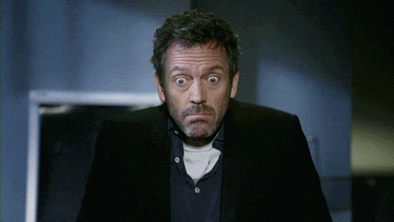

# Cours d'introduction

Welcome to Français Moderne!

## Méthodologie de la recherche en linguistique française

## La ou les grammaires ?

## Les institutions de la langue française

### L'académie française

> « L'académie française a été instaurée par Richelieu gardienne de la langue » — *Académie française*

**↔**

> « Depuis le XIXe siècle, l'académie française ne suit plus l'évolution de la langue » — *Les linguistes atterrés*

**Quel est son rôle ?**

-   Institution d'Ancien Régime fondée en 1635

-   Selon ses statuts, elle doit rédiger " promptement " 😝 un dictionnaire et une grammaire dans le but de " donner des règles certaines à notre langue et à la rendre pure, éloquente et capable de traiter les arts et les sciences

{fig-align="right"}

## Séances thématiques

Si on vous dit: C'EST FAUX !

-   Pourquoi ?

-   Depuis quand ?

-   Où est la règle ?
