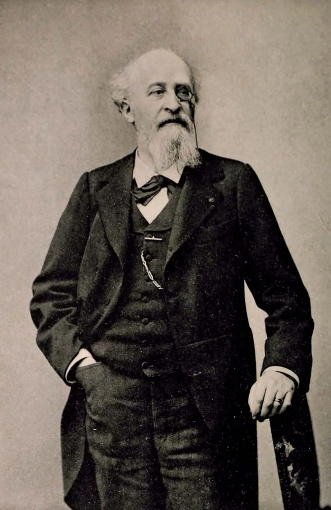

# Cours d'introduction

Welcome to Français Moderne!

## Méthodologie de la recherche en linguistique française

## La ou les grammaires ?

## Les institutions de la langue française

### L'académie française

> « L'académie française a été instaurée par Richelieu gardienne de la langue » — *Académie française*

**↔**

> « Depuis le XIXe siècle, l'académie française ne suit plus l'évolution de la langue » — *Les linguistes atterrés*

**Quel est son rôle ?**

-   Institution d'Ancien Régime fondée en 1635

-   Selon ses statuts, elle doit rédiger " promptement " 😝 un dictionnaire et une grammaire dans le but de " donner des règles certaines à notre langue et à la rendre pure, éloquente et capable de traiter les arts et les sciences

{fig-align="right"}

-   1er dictionnaire en 1694: objectif élitiste assumé pour "distinguer les gens de lettres d'avec les ignorants et les simples femmes "

-   Au total 9 éditions, la dernière en 2026

-   Mais beaucoups de critiques !

-   Un best-of : 😅

    -   *bisou* absent

    -   *mail* est défini comme gros marteau ou une promenande plantée d'arbres

    -   *femme* est définie *comme capable de concevoir et de mettre au monde des enfants*

    -   racisme

    -   homophobie

    -   *etc.*

-   L'Académie n'a jamais publié une grammaire

-   Jusqu'au XIXe siècle, ils ont bien essayé d'avoir un regard (timide) mais critique sur l'orthographe et ont simplifié certaines graphies

    -   Ex. pluriels en *-x* comme *loix* et *roix*

    -   Ex. certains *-h* comme *autheur* et *rhythme*

        ------------------------------------------------------------------------

-   à la fin du XIXe siècle, Gaston Paris est un exemple d'académicien non puriste

-   L'enseignement du français doit " sortir de ces marécages " de règles, "être plus fructueus pour l'esprit et un peu moins dangereus pour le sens "

[{fig-align="right" width="500"}](https://cdn.britannica.com/11/172811-050-2A5CEC8E/Gaston-Paris.jpg)

## Séances thématiques

Si on vous dit: C'EST FAUX !

-   Pourquoi ?

-   Depuis quand ?

-   Où est la règle ?

## Séances thématiques

Si on vous dit: C'EST FAUX !

-   Pourquoi ?

-   Depuis quand ?

-   Où est la règle ?
