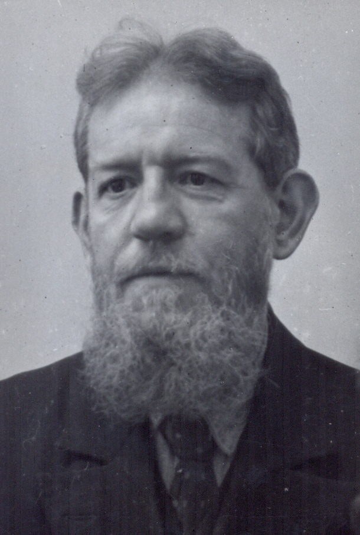
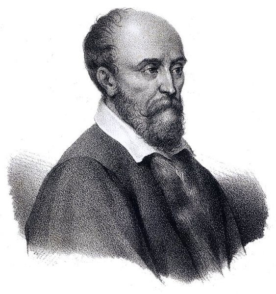

# Morpho-syntaxe - Accord du participe passé

## Introduction - le discours publique

> L'accord du participe passé: " Il n'y a rien de plus important ny de plus ignoré."
>
> — Claude Favre de Vaugelas (Grammairien), 1647

> "La règle est morte de complications."

> — Lucien Tesnière (Linguiste), 1959

## Histoire du participe passé

-   Jusqu'au XIIIe siècle, l'ordre des mots est relativement libre:
    -   Si auxiliaire être: accord avec le sujet
    -   Si auxiliaire avoir: accord avec le COD, peu importe sa position dans la phrases
        -   Ex. *J'ai les lettres écrit[**es**]{.underline}.*
        -   Ex. *J'ai écrit[**es**]{.underline} les lettres.*
        -   le participe passé s'accordait alors comme un attibut de l'objet: par exemple, *j'ai les mains salies*

------------------------------------------------------------------------

-   XVIe siècle:
    -   l'ordre des mots devient plus figé *auxiliaire - participe - objet*:
        -   Si auxiliaire être: accord avec le sujet
        -   L'accord avec avoir est en diminution

------------------------------------------------------------------------

-   XVIe siècle:
    -   Clément Marot *Épigrammes* dédiées à François Ier, 1538
    -   Il propose d'accorder le participe passé avec l'objet si ce dernier est placé avant le participe passé sur la base du modèle italien 🍝
        -   Ex. *Dieu en ce monde [nous]{.underline} a faict[z]{.underline} \<--\> Dio [noi]{.underline} a fatt[i]{.underline}*

------------------------------------------------------------------------

-   XVIe siècle:
    -   L'usage de cette règle n'est pas encore systémique

> Mignonne, allons voir si la rose
>
> Qui ce matin avait desclos[e]{.underline}
>
> [Sa robe de pourpre]{.underline} au soleil...

------------------------------------------------------------------------

-   XVIe siècle:
    -   On entend plus l'accord car on ne prononce plus le *-s* final
        -   Ex. *Je les ai vu[**s**]{.underline}* /ʒə lez e [**vy**]{.underline}/
    -   Sauf en case de liaison
        -   Ex. *Je les ai vu[**s**]{.underline} à la fête* /ʒə lez e vy[**z**]{.underline} a la fɛt/

## Les données linguistiques en français

## Les données linguistiques ailleurs dans le monde

## Considération théoriques

# Participe passé employé avec *avoir*

Employé avec l'auxiliaire **avoir**, le participe passé **ne s'accorde jamais avec le sujet** du verbe.

## Synthèse des règles d'accord {.scrollable}

Les locutions **« ci-joint »**, **« ci-inclus »** et **« ci-annexé »** changent de comportement syntaxique selon leur position exacte dans la phrase. On distingue trois cas de figure principaux :

### L'accord obligatoire (valeur d'adjectif)

Lorsque la locution est placée immédiatement **après le nom** qu'elle qualifie, elle se comporte comme un adjectif qualificatif ordinaire. Elle s'accorde donc obligatoirement en genre et en nombre avec ce nom.

-   *Exemple :* « Vous trouverez ci-après les documents **ci-joints** pour votre dossier. »
-   *Exemple :* « La note explicative **ci-incluse** vous donnera tous les détails nécessaires. »

### L'invariabilité obligatoire (valeur d'adverbe)

Lorsque la locution est placée **en tout début de phrase**, ou bien à l'intérieur de la phrase mais **immédiatement devant un nom sans déterminant**, elle joue le rôle d'un adverbe. Elle reste alors strictement invariable.

-   *Exemple :* « **Ci-joint** la copie des rapports que vous avez demandés la semaine dernière. »
-   *Exemple :* « Vous voudrez bien trouver **ci-inclus** note de service concernant les horaires. »

### L'accord au choix (corps de la phrase avec déterminant)

Lorsque la locution est placée **dans le corps de la phrase**, devant un nom lui-même **précédé d'un déterminant** (un article, un possessif, etc.), la syntaxe est plus souple. L'accord est laissé au choix de l'auteur : on peut accorder en considérant la locution comme un adjectif, ou la laisser invariable en privilégiant sa valeur adverbiale.

-   *Exemple (choix invariable) :* « Je vous adresse **ci-joint** *les* statistiques du dernier trimestre. »
-   *Exemple (choix accordé) :* « Je vous adresse **ci-joints** *les* statistiques du dernier trimestre. »

------------------------------------------------------------------------

### Exemples d'application

::: {layout-ncol="2"}
#### 🟢 Emploi Adjectif (Accord)

-   « Vous trouverez les pièces **ci-jointes**. »
-   « La lettre **ci-incluse** vous informera. »

#### 🔴 Emploi Adverbe (Invariable)

-   « **Ci-joint** la copie de vos documents. »
-   « Veuillez trouver **ci-inclus** les pièces. »
:::

::: callout-tip
## Astuce

La position dans la phrase détermine l'accord : si la locution est **avant le nom (ou isolée)**, elle agit comme un adverbe (invariable). Si elle est **après le nom**, elle agit comme un adjectif ordinaire (accordé).
:::

------------------------------------------------------------------------

## L'accord du participe passé

## Synthèse
